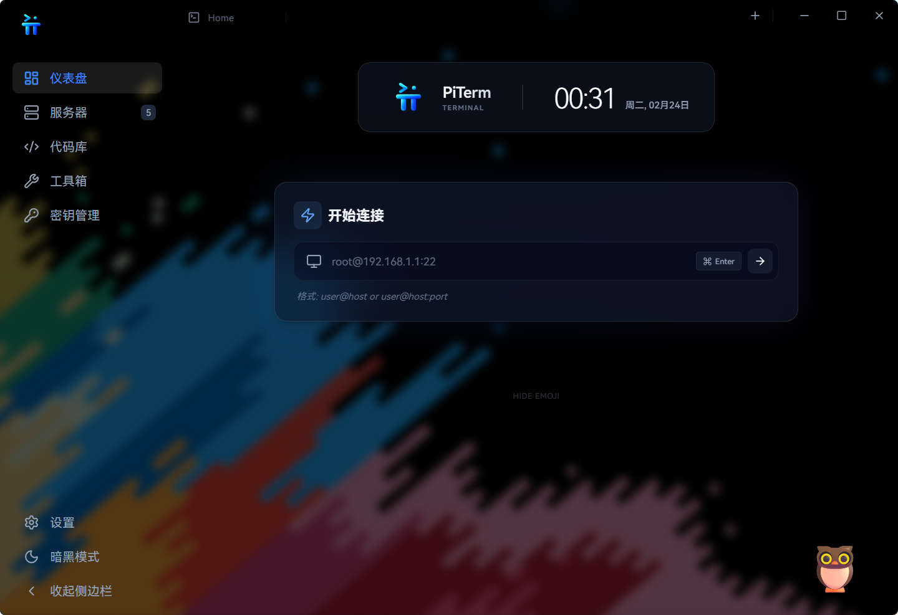
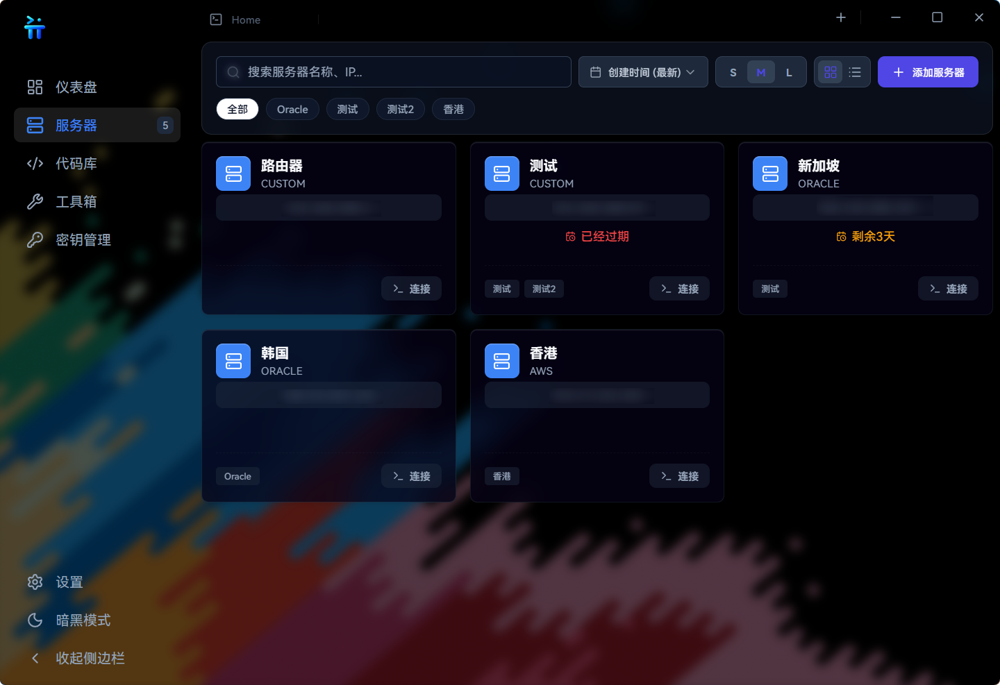
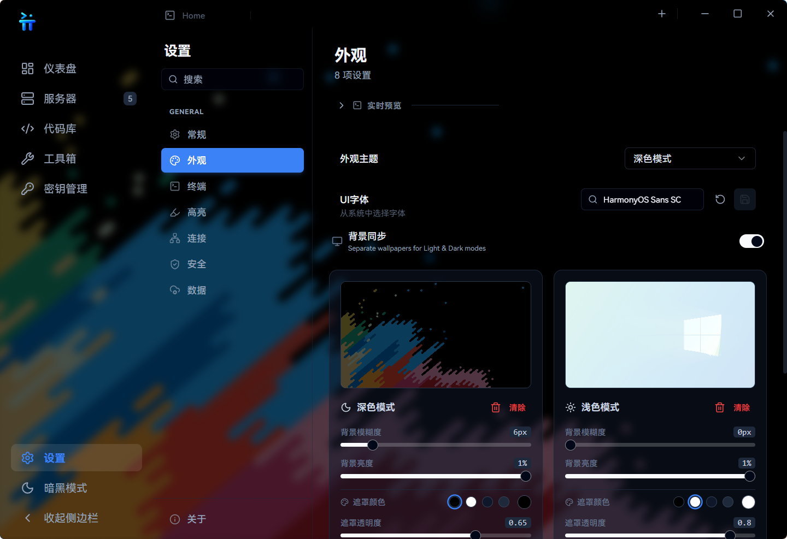

# PiTerm

<p align="center">
  A lightweight, secure, and modern desktop terminal built with Tauri + Rust.
</p>

---

## 🚀 About

PiTerm 是一款基于 **Tauri + Rust** 构建的跨平台桌面终端应用。  
前端采用 **xterm.js** 进行高性能终端渲染，专注于提供轻量、安全、可扩展的本地 Shell 体验。

相比传统 Electron 终端应用，PiTerm：

- 显著降低内存占用
- 提升启动速度
- 强化系统权限控制
- 保持现代化 UI 体验

---

## 🖼 Screenshots

### 主界面



### 其它界面



> 更多截图请查看 `docs/screenshots/` 目录。

---

## ✨ Core Features

- 🖥️ 基于 **xterm.js** 的高性能终端渲染
- ⚡ 轻量架构：Tauri + Rust
- 🔒 安全优先：Rust 后端 + Tauri 权限模型
- 🧩 前后端解耦设计
- 🎨 现代化 UI，支持主题与扩展
- 🌍 Windows / macOS / Linux 跨平台支持

---

## 🛠 Tech Stack

- Tauri v2
- Rust
- React
- xterm.js
- pnpm

---

## 📦 Development

### Requirements

- Node.js >= 18
- pnpm
- Rust (stable)
- Tauri CLI

### Run in development mode

```bash
pnpm install
pnpm tauri dev
pnpm tauri build

📄 License

Copyright © 2026 MrShellad

All rights reserved.

This project is currently not open source.
You may not copy, modify, distribute, or publish this software without explicit permission from the author.